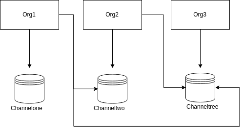
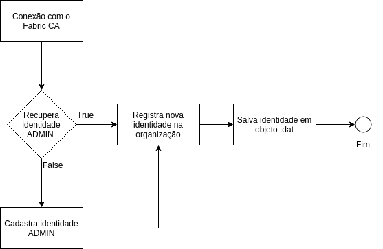
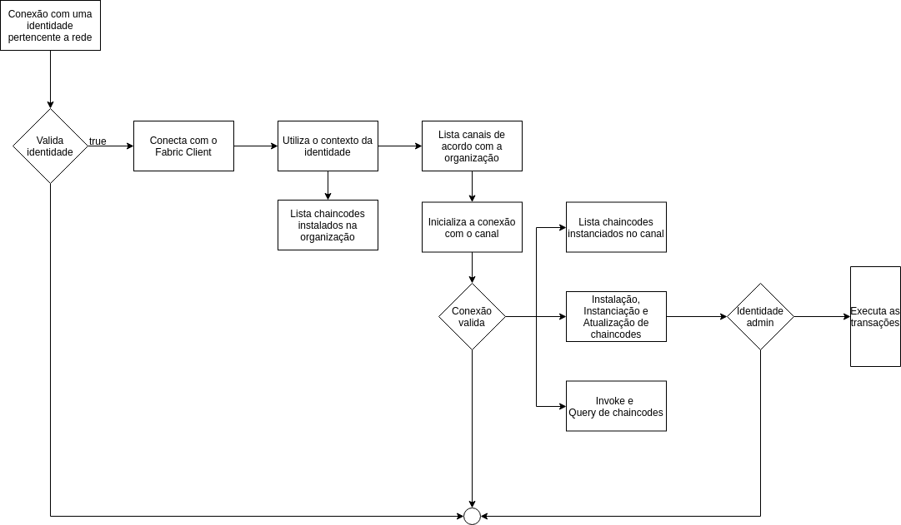

# Hyperledger Fabric - SDK Java

#### Introdução
Está aplicação tem como finalidade criar uma API REST, utilizando Java Spring Boot, para comunicação com a rede Fabric, podendo assim gerenciar todo a rede e suas funcionalidades. A comunicação entre o cliente e a rede fabric utiliza chamadas do SDK Java, disponibilizado em [Hyperledger Fabric SDK Java](https://github.com/hyperledger/fabric-sdk-java)

#### Funcionalidades
As seguintes funcionalidades foram desenvolvidas para esta aplicação.

##### Identidades
* Registro de novas identidades para organizações
* Revogação de identidades [PROGRESSO]
* Listagem de identidades 

##### Canal
* Criar canal [PROGRESSO]
* Conexão com canal para transações
* Listagem de canais, de acordo com o acesso da organização

##### Peer
* Listagem de chaincodes instalados na organização
* Listagem de chaincodes instanciados no canal

##### Chaincodes

###### Identidades Administradoras
* Instalação de chaincode
* Iniciação de chaincode, com política de endorsamento
* Atualização de chaincode, com política de endorsamento

###### Identidades Membros
* Invoke chaincode
* Query chaincode

##### Transações
* Informações sobre transações utilizando ID
* Informações sobre o bloco, utilizando uma ID
* Informações sobre o bloco, utilizando o número do bloco

**OBS: Comunicação utilizando TLS e arquivo de conexão para inicialização.**

#### Organização do projeto
-> src/main/java: *Projeto java* 

-> chaincode/src/github.com/hyperledger-fabric-go-chaincodes: *Localização dos chaincodes*

-> endorsementypolicy: *Localização dos arquivos de política*

-> network: *Localização dos arquivos de configuração da rede Fabric*

-> wallet: *Localização das identidades pertencentes a rede**

**OBS: O projeto inicial conta com as identidades de administrador das 3 oganizações, definidas como objetos serializados em arquivos .dat**

#### Primeiros passos
Para iniciar a aplicação é necessario:

**a.** Rede Fabric em pé

**b.** Arquivo de conexão definindo a rede

**c.** Arquivo de conexão definindo os chaincodes

**d.** Executar a aplicação Java

**e.** Acessar swagger

**f.** Conectar cliente websocket
 
#### Levantando a rede fabric
1. Navegar para a pasta *./network*
2. Executar o script start *~./start~*
3. Aguardar o termino do script

#### Arquivo de conexão definindo a rede
A rede fabric levantada no passo anterior possui a seguinte configuração:
* 3 organizações
* 2 peers/org
* 2 orderers
* 3 canais
* ** 3 identidades administradoras, respectivamente, org1,org2,org3**

**PS: O arquivo de configuração pode ser visto em ./network/connection**

#### Acessando a página swagger 

Para visualização de rotas e serviços, acessar: http://localhost:3000/swagger-ui.html

##### Executar a aplicação java
Utilizando uma IDE de sua preferencia
* Importar projeto
* Executar o main, como aplicação Java.
* Fazer requisições pelo localhost:3000/...

**OBS: Para facilitar o teste de outras redes fabric, com diferentes arquiteturas, o [script](https://gitlab.com/natanael.soares/network) a seguir é recomendado. Onde é possível desenhar uma arquitetura diversificada e obter todo os arquivos necessarios para configuração da aplicação, sendo necessario a substituição da pasta network pela nova configuração e a criação de novas identidades.**

#### Fluxo de utilização da aplicação

##### Fluxo de identidade

##### Fluxo transações

